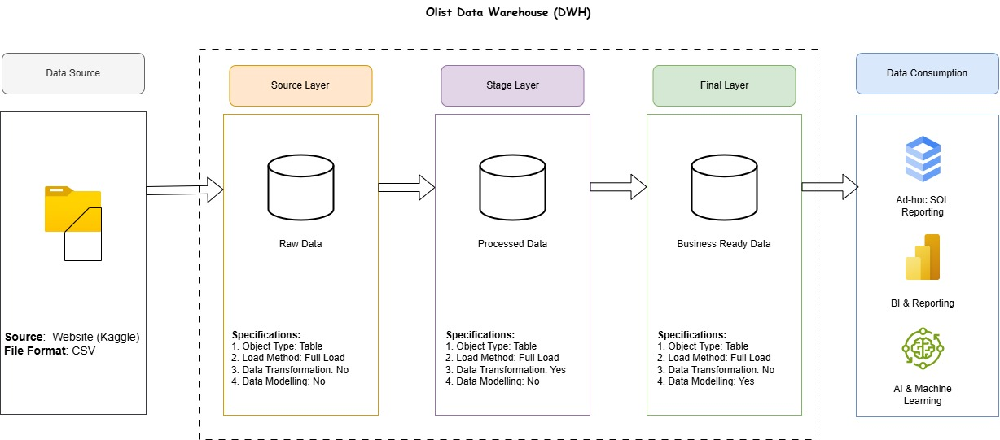
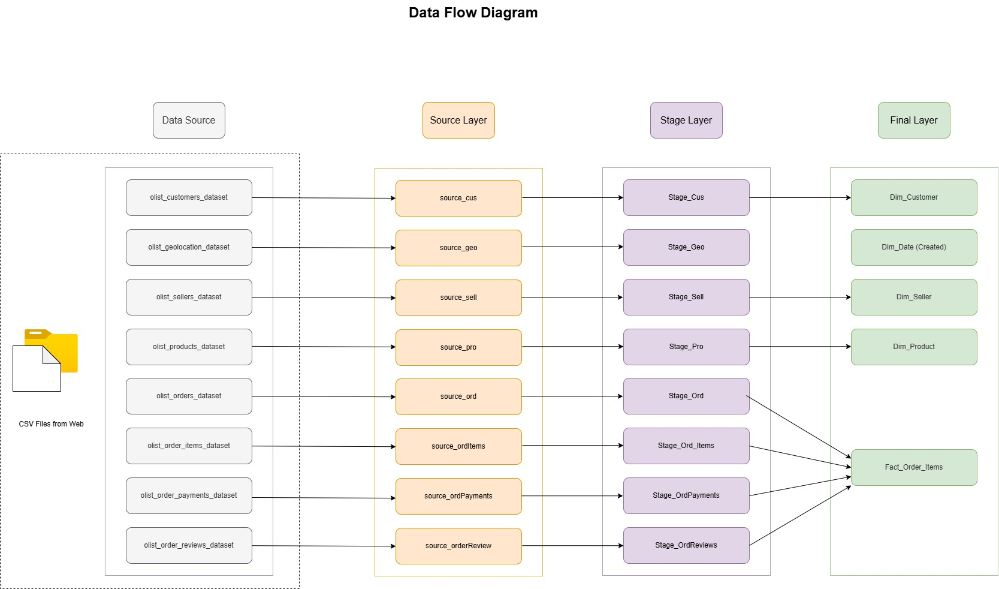
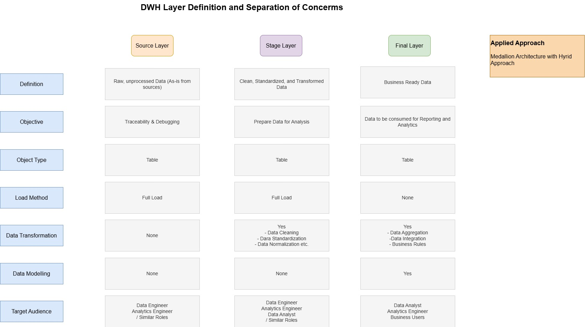

# A-Modern-Data-Warehouse-sql

**End-to-End Data Warehouse Project** implementing a Medallion-inspired architecture, ETL pipeline, data quality validation, and a Kimball dimensional model using Microsoft SQL Server.

---

## Project Overview

Olist, a Brazilian e-commerce marketplace, generates transactional data spread across multiple disconnected CSV extracts — orders, customers, sellers, payments, and reviews — making cross-functional reporting slow and error-prone. This project builds a centralized **Data Warehouse (`Olist_DWH`)** on SQL Server that ingests, cleans, and models this raw data into a Kimball-style **Star Schema**. The result is a single source of truth that supports fast, scalable analytical queries for sales performance, customer behavior, and seller performance — ready to plug into any BI tool (Power BI, Tableau, etc.) without further transformation.

**Key goals of this project:**
- Design a full-cycle DWH: ingestion → cleaning → dimensional modeling
- Apply Kimball-style star schema modeling to a real, messy, multi-table dataset
- Build in data quality checks at each layer rather than assuming clean data
- Handle several common real-world challenges in data projects: clean up messy data, deduplication, granularity, etc.
- SQL development best practices

---

## Key Features

✔ End-to-End ETL Pipeline

✔ Medallion-inspired Data Warehouse Architecture

✔ Kimball Star Schema

✔ SQL Server & T-SQL

✔ Data Cleaning & Transformation

✔ Data Quality Validation

✔ Fact & Dimension Modeling

✔ Business-Ready Analytics Layer

---

## Architecture & Data Pipeline

The pipeline follows a three-layer Medallion architecture, renamed to keep the project's own terminology:

| Medallion term | This project's term | Purpose |
|---|---|---|
| Bronze | **Source Layer** | Raw data, loaded as-is from source (full load, batch) |
| Silver | **Stage Layer** | Cleaned, standardized, type-corrected, per-table |
| Gold | **Final Layer** | Integrated, dimensionally modeled (star schema) for reporting |

### 1. Data Warehouse Architecture
The high-level system architecture illustrating how data moves from the raw Kaggle dataset, through the staging layers, and into the final analytical data warehouse.

---

### 2. Data Flow Diagram (DFD)
A detailed view showing the exact movement, transformation logic, and dependencies of the data as it travels between source files and target tables.

---

### 3. DWH Layer Definition
The structural breakdown of our data warehouse layers (Staging vs. Production), outlining the purpose, schema rules, and storage definitions for each stage.

                                                       
---
